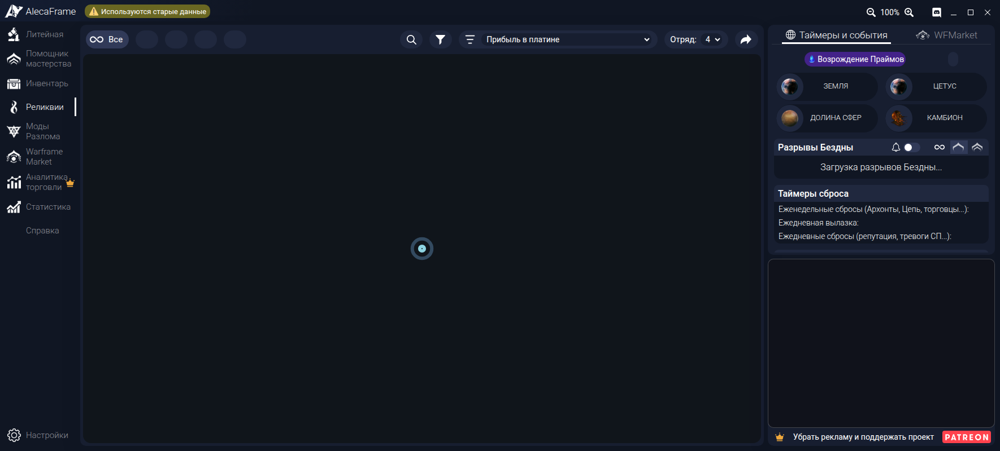
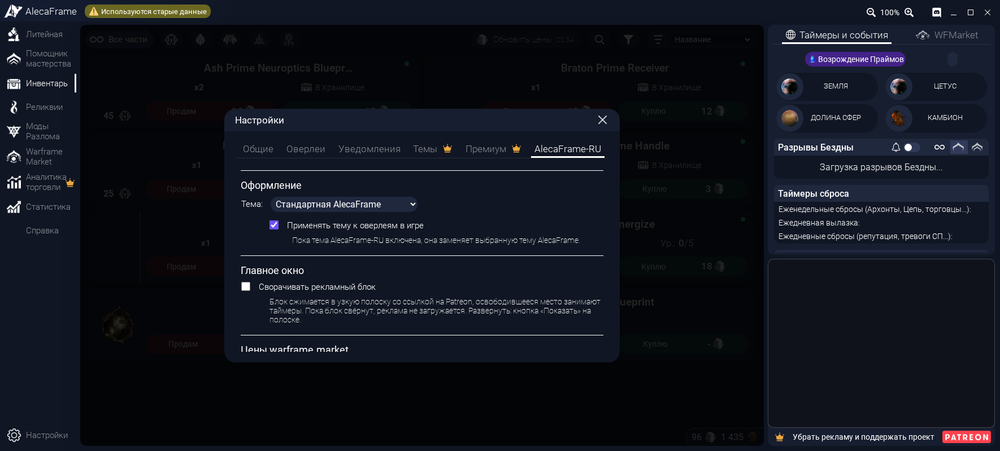
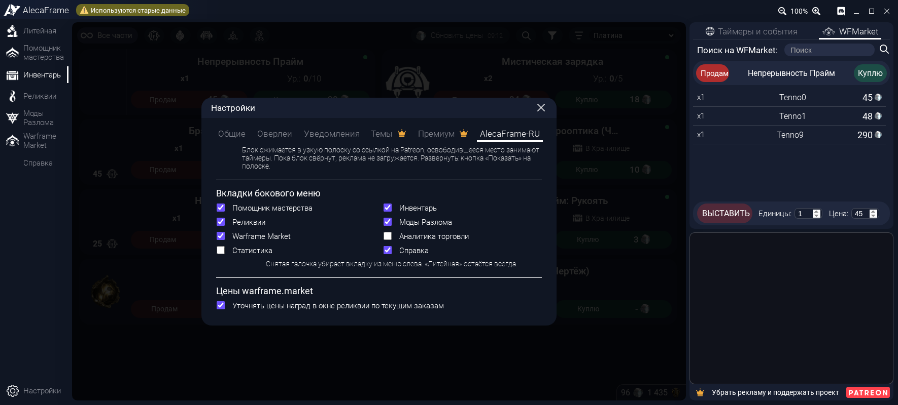
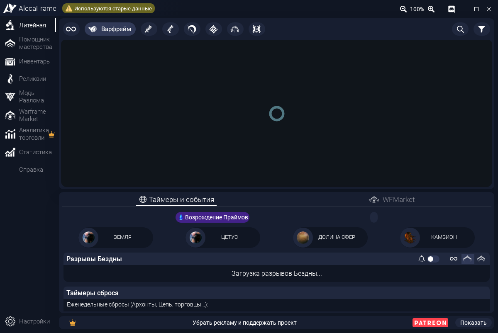

# AlecaFrame-RU

Неофициальный **русский интерфейс для [AlecaFrame](https://alecaframe.com/)**, приложения-компаньона для Warframe, которое работает внутри Overwolf.



<sub>Окно AlecaFrame 2.6.90 в тестовом стенде без данных игры, поэтому списки пустые. Это не снимок из живого Overwolf.</sub>

**[Скачать последнюю версию](https://github.com/Areral/AlecaFrame-RU/releases/latest)** · [Установка](#установка) · [Как пользоваться](#как-пользоваться) · [Проблемы](#если-что-то-пошло-не-так) · [Сообщить об ошибке](https://github.com/Areral/AlecaFrame-RU/issues)

## Что это такое

AlecaFrame показывает инвентарь Warframe, цены warframe.market, реликвии, моды Разлома, таймеры и оверлеи в игре. Официально он есть только на английском.

AlecaFrame-RU — набор скриптов для Windows, который один раз устанавливается и дальше сам подключает к AlecaFrame перевод и несколько удобств:

- **Перевод всего интерфейса.** Меню, кнопки, настройки, подсказки, оверлеи реликвий и модов Разлома, TennoFinder, список изменений. Переведено 900 из 900 строк AlecaFrame 2.6.90. Термины взяты из официальной русской версии Warframe: Литейная, Моды Разлома, Реликвии, Стальной Путь. Где русский текст длиннее английского, подправлены отступы, чтобы ничего не обрезалось.
- **Названия и описания предметов** как в русской версии игры: варфреймы, оружие, части, моды, мистификаторы, реликвии и ресурсы, а в окне «О предмете» — описания, способности, характеристики оружия и дерево создания.
- **Дополнительные функции** на вкладке **Настройки → AlecaFrame-RU**: своя тёмная тема, обновление цен с warframe.market, быстрые точные цены в окне наград реликвии, скрытие ненужных вкладок, сворачивание рекламного блока. Подробнее в разделе [«Как пользоваться»](#как-пользоваться).

Программу AlecaFrame (DLL), её данные и файлы игры проект не меняет. Пока Overwolf работает с переводом, в страницы AlecaFrame добавлена одна строка, а когда Overwolf закрыт, файлы в исходном виде.

## Что нужно

- Windows 10 или 11.
- [Overwolf](https://www.overwolf.com/) с установленным **AlecaFrame**, который вы хотя бы раз открывали.
- Больше ничего: Node.js, Python и прочие программы не нужны.

## Установка

Устанавливать нужно **один раз**. Потом AlecaFrame открывается на русском сам: после перезагрузки Windows, после обновлений AlecaFrame и Overwolf.

1. Откройте **[страницу последней версии](https://github.com/Areral/AlecaFrame-RU/releases/latest)** и в разделе **Assets** скачайте **Source code (zip)**. Также подойдёт кнопка **Code → Download ZIP** на главной странице репозитория.
2. Распакуйте архив в любую папку, хоть в «Загрузки». Установка скопирует всё нужное в `%LOCALAPPDATA%\AlecaFrame-RU`, после неё архив и папку можно удалить.
3. Выйдите из игры. Если Overwolf запущен, ничего не делайте: установка перезапустит его сама.
4. Дважды щёлкните **`Install.cmd`**.
   - Windows может показать предупреждение SmartScreen, потому что файл скачан из интернета. Это обычные текстовые скрипты, их можно открыть в Блокноте и прочитать. Нажмите **«Подробнее → Выполнить в любом случае»**.
5. Появится описание того, что будет сделано (подробно в разделе [«Важно про безопасность»](#важно-про-безопасность)). Если согласны, введите `да` и нажмите Enter.
6. Подождите, обычно меньше минуты. Overwolf перезапустится, AlecaFrame откроется на русском, а в окне установки появится надпись «Готово». Окно можно закрыть.

Что появится после установки:

- **фоновый процесс без окна** (PowerShell) в автозагрузке Windows. Он следит, чтобы Overwolf работал с нужным флагом, и подключает перевод. Если Overwolf запустился сам вместе с Windows или после своего обновления, процесс один раз перезапускает его — это нормально;
- ярлыки **«AlecaFrame (русский)»** на рабочем столе и в меню «Пуск»: открывают AlecaFrame, а если Overwolf ещё не запущен — запускают и его;
- запись **AlecaFrame-RU** в «Параметры → Приложения», через неё можно удалить.

AlecaFrame можно открывать и обычным способом, через Overwolf: перевод будет и там.

> Ставили прошлую версию с `Start.cmd`? Просто запустите `Install.cmd` из новой. Он закроет старое чёрное окно, оно больше не нужно. `Start.cmd` оставлен для привычки и делает то же, что `Install.cmd`.

## Как пользоваться

Все дополнительные функции находятся на вкладке **Настройки → AlecaFrame-RU** (шестерёнка внизу слева). Настройки общие для всех окон AlecaFrame и сохраняются между запусками. Перевод работает всегда, остальное включается по желанию.



### Тема «Графит»

**Оформление → Тема → «Графит»**: нейтральная тёмная тема без синих и фиолетовых оттенков, с бирюзовым акцентом. Это собственные цвета AlecaFrame-RU, а не платная тема AlecaFrame. Галочка «Применять тему к оверлеям в игре» перекрашивает и окна поверх игры.

### Свежие цены в инвентаре

Во вкладке **«Инвентарь»** справа вверху есть кнопка **«Обновить цены»**. Она загружает текущие заказы игроков онлайн с warframe.market для показанных предметов через встроенный в AlecaFrame клиент warframe.market.

- Для модов и мистификаторов учитывается ранг, для реликвий — улучшение.
- До 3 запросов одновременно и не чаще 3 в секунду, как требует warframe.market. Повторный клик останавливает загрузку.
- Карточка с обновлённой ценой отмечается зелёной точкой. Цены хранятся 1 час, сбросить их можно кнопкой «Сбросить сохранённые цены» в настройках.
- При сортировке «Платина» (и «Дуканатор») список пересортировывается по новым ценам продажи, когда загрузка закончится: от большей к меньшей, предметы без цены в конце. Стрелка рядом с сортировкой меняет направление, как и в самом AlecaFrame.

### Окно наград реликвии

Когда в игре открывается выбор награды, цены наград уточняются по текущим заказам на warframe.market, и «лучшая» награда подсвечивается по ним.

- Окно запускается сразу, как только страница готова. Сам AlecaFrame ждёт ещё и загрузки рекламы.
- Цены, загруженные за последние 10 минут (в том числе кнопкой «Обновить цены»), показываются мгновенно, без запроса. Остальные запрашиваются одновременно, по одному запросу на награду, даже если у двух игроков она одинаковая. Форма, Адаптер Эксилус, Осколки Разлома, Кува и Отголоски Бездны не запрашиваются: на warframe.market их не продают.
- Заодно исправлена ошибка AlecaFrame: когда ни у одной награды нет цены, подсвечивались все карточки сразу, теперь не подсвечивается ни одна.
- Отключается галочкой «Уточнять цены наград в окне реликвии по текущим заказам». Тогда остаются цены AlecaFrame.

### Скрыть ненужные вкладки

**Вкладки бокового меню**: снимите галочку, и вкладка пропадёт из меню слева, например «Аналитика торговли» или «Статистика». Галочка обратно — вкладка вернётся. «Литейная» и «Настройки» остаются всегда. Если скрыть открытую сейчас вкладку, AlecaFrame переключится на «Литейную».



### Названия и описания предметов

Варфреймы, оружие, части, моды, мистификаторы, реликвии и ресурсы называются по-русски, как в русской версии игры: «Нова Прайм: Система (Чертёж)», «Мистическая зарядка», «Лит G1 (целая)». В окне «О предмете» по-русски описания предметов и компонентов, способности, пассивные умения, эффекты модов и мистификаторов по рангам, характеристики оружия («Очередь», «Предрасп. к Разлому», «По области») и названия в дереве создания.

- Названия взяты из официальной локализации Warframe, которую AlecaFrame скачивает вместе со своими данными, описания — из публичных данных Digital Extremes. Формат частей и комплектов такой же, как на warframe.market.
- Поиск AlecaFrame по-прежнему ищет по английским названиям.
- Около 400 предметов, у которых нет русского названия ни в игре, ни на warframe.market, остаются на английском.

### Свернуть рекламный блок

**Главное окно → «Сворачивать рекламный блок»**. Блок 400×300 справа внизу сжимается в узкую полоску со ссылкой на Patreon, а освободившееся место занимают таймеры и события. Чтобы вернуть блок, нажмите **«Показать»** на полоске или снимите галочку.



- По умолчанию выключено: пока вы сами не включите, реклама показывается как обычно.
- Пока блок свёрнут, реклама не загружается. AlecaFrame сам делает так же, когда блок закрывают его окна. Поэтому скрытая реклама не крутится впустую и не засчитывает показы, которых никто не видел.
- Работает только в главном окне. Реклама в окне наград реликвии остаётся.
- Если AlecaFrame вам полезен, поддержите автора на [Patreon](https://www.patreon.com/AlecaFrame): подписка убирает рекламу везде и даёт платные функции.

## Обновление

Скачайте новую версию (**Source code (zip)**) со [страницы релизов](https://github.com/Areral/AlecaFrame-RU/releases/latest), распакуйте куда угодно и запустите `Install.cmd`. Он остановит прежний фоновый процесс, заменит файлы и снова откроет AlecaFrame. Повторно соглашаться не нужно.

Обновления самого AlecaFrame ставятся как обычно: перевод подключится к новой версии сам. Если после обновления часть надписей стала английской, значит, в новой версии появились новые строки. Напишите в [issues](https://github.com/Areral/AlecaFrame-RU/issues), их переведут.

## Удаление

**«Параметры → Приложения → AlecaFrame-RU → Удалить»** или двойной щелчок по **`Uninstall.cmd`** из архива. Удаление:

- останавливает фоновый процесс;
- закрывает Overwolf, если он запущен с отключённой проверкой файлов, и запускает его снова обычным образом;
- возвращает исходные файлы AlecaFrame;
- убирает автозагрузку, ��рлыки «AlecaFrame (русский)», запись в «Приложениях» и папку `%LOCALAPPDATA%\AlecaFrame-RU`.

После этого AlecaFrame работает как обычно, на английском, и с обычной проверкой файлов.

## Если что-то пошло не так

| Что видите | Что делать |
| --- | --- |
| AlecaFrame на английском | Откройте его ярлыком «AlecaFrame (русский)»: он запустит фоновый процесс, если тот не работает. Не помогло — запустите `Install.cmd` ещё раз. |
| Overwolf перезапускается при запуске | Один перезапуск — это нормально: Overwolf запустился без нужного флага, и фоновый процесс перезапустил его с флагом. Больше двух перезапусков за 10 минут процесс не делает. |
| Вопрос «Ваша сборка Overwolf проверяет файлы даже с флагом extension-validation» | Новые сборки Overwolf закрывают изменённый AlecaFrame и с этим флагом. Файлы уже возвращены. Во время установки вопрос появляется в её окне, в остальное время — отдельным окном. Если ответить «да», Overwolf перезапустится ещё и с флагом `force-validation-report-only` (см. [безопасность](#важно-про-безопасность)); ответ запомнится. Если ответить «нет», AlecaFrame останется на английском. |
| Установка пишет «Ответ «нет» на вопрос о флаге force-validation-report-only» | Перевод отключён, потому что на вопрос ответили «нет» (в отдельном окне по умолчанию выбрана кнопка «Нет», её нажимает Enter). Запустите `Install.cmd` ещё раз и ответьте `да`. |
| Окно «Overwolf закрыл изменённый AlecaFrame даже в режиме force-validation-report-only» | С вашей сборкой Overwolf перевод пока не работает. Файлы возвращены, AlecaFrame работает на английском. Создайте [issue](https://github.com/Areral/AlecaFrame-RU/issues) и приложите `launcher.log` (см. ниже): туда записаны версия Overwolf, его командная строка и строки его журнала о проверке. |
| «Overwolf запущен от имени администратора» | Фоновый процесс не видит флагов такого Overwolf. Выйдите из Overwolf и запустите его обычным способом. |
| AlecaFrame не открывается или сразу закрывается | Запустите `Uninstall.cmd`, затем `Install.cmd`. Если не помогло, переустановите AlecaFrame через Overwolf. |
| Установка пишет «перевод ещё не подтвердился» | Подождите и откройте AlecaFrame ярлыком «AlecaFrame (русский)». Если он так и остаётся на английском, создайте issue и приложите `launcher.log`. |
| Часть надписей осталась на английском | Скорее всего, ваша версия AlecaFrame новее 2.6.90. Создайте issue со скриншотом, их переведут. |
| «Обновить цены» пишет «нет связи» | AlecaFrame не ответил на запрос к warframe.market. Проверьте, что игра и AlecaFrame запущены, и нажмите ещё раз. |

Журнал фонового процесса: `%LOCALAPPDATA%\AlecaFrame-RU\launcher.log`. Вставьте этот путь в адресную строку Проводника.

## Важно про безопасность

Overwolf проверяет файлы каждого приложения по подписанному списку и закрывает изменённый AlecaFrame. Поэтому любой способ подключить перевод требует отключить эту проверку. Здесь это сделано так:

- фоновый процесс запускает Overwolf с флагом `--ow-disable-features=extension-validation,read-opk-from-memory`, а если Overwolf запустился без флага, перезапускает его;
- проверка отключается **для всех приложений Overwolf**, а не только для AlecaFrame, и **всё время, пока AlecaFrame-RU установлен**. После удаления Overwolf снова запускается с проверкой;
- в 9 страниц AlecaFrame добавляется одна строка `<script src="assets/js/alecaframe-ru.js">`, больше ничего не меняется. Если удалить эту строку, файл побайтово совпадёт с исходным, это проверяется тестами. Когда Overwolf закрыт или запущен без флага, строка убрана;
- фоновый процесс — это скрипт `windows\Agent.ps1`, его можно прочитать. Раз в 2 секунды он смотрит список процессов Overwolf и их командные строки, журналы Overwolf и AlecaFrame и меняет файлы только в папке AlecaFrame. В интернет он не ходит, прав администратора не просит;
- пока AlecaFrame-RU установлен, другие приложения Overwolf не проверяются на подмену. Если вы не готовы на это, пользуйтесь AlecaFrame на английском.

Новые сборки Overwolf проверяют файлы и с этим флагом и закрывают AlecaFrame с ошибкой `HashMismatch`. Так было на AlecaFrame 2.6.94; у [DDA-007/AlecaFrame-ZH](https://github.com/DDA-007/AlecaFrame-ZH) то же самое на Overwolf 0.310.1.1. В этом случае фоновый процесс возвращает файлы и **спрашивает** (в окне установки, а если оно уже закрыто — в отдельном окне), можно ли запускать Overwolf с ещё одним флагом, `--ow-enable-features=force-validation-report-only`:

- Overwolf по-прежнему сверяет файлы, но при несовпадении только пишет об этом в свой журнал и не закрывает приложение. Защиты от подмены файлов в этом режиме нет, так же как с первым флагом;
- режим тоже действует **для всех приложений Overwolf** и **всё время, пока AlecaFrame-RU установлен**;
- ответ сохраняется в `%LOCALAPPDATA%\AlecaFrame-RU\report-only-v1`. Чтобы отозвать согласие, запустите `Uninstall.cmd`.

Без вашего «Да» этот флаг не используется. Первый флаг взят у [AlecaFrame-ZH](https://github.com/191086215333/AlecaFrame-ZH-), второй — у форка DDA-007.

Чего проект не делает:

- **Не включает платные функции** и не трогает подписку и Patreon: «Аналитика торговли», платные темы и прочее остаются за подпиской. Рекламу он только сворачивает, и только если вы включили это в настройках. Скрытие вкладок только убирает пункт из меню.
- Не переводит то, что уходит другим людям: сообщения продавцу на WFMarket и уведомления в Discord остаются на английском.

Автор AlecaFrame этот проект не поддерживал и не проверял. Используйте на свой риск.

## Что проверено, а что нет

| | Статус |
| --- | --- |
| Перевод: 900 из 900 строк версии 2.6.90 | Проверено: автотесты, в том числе с Vue 3.2.31 (как в AlecaFrame), и настоящая страница `main.html` в headless Chrome б��з новых обрезаний текста |
| Окно «О предмете» и дерево создания: описания, характеристики, кнопки «Продам» / «Куплю» | Проверено: настоящая `main.html` в headless Chrome с данными AlecaFrame 2.6.90, окна 1600×900 и 1280×720. В узком окне длинные значения слева от характеристик обрезаются, английская версия там вылезает за край окна |
| Установка, фоновый процесс, удаление: подключение и возврат файлов, решения процесса (когда перезапускать Overwolf, когда открывать AlecaFrame), разбор флагов и журнала Overwolf, ярлыки, запись в «Приложениях» | Проверено: 65 проверок на поддельной папке AlecaFrame и заглушках вместо Overwolf, PowerShell 7.6 на Linux, плюс проверка кодировок и переводов строк `.ps1` и `.cmd` |
| **Установка и фоновый процесс на настоящей Windows и с настоящим Overwolf** | **Не проверено.** Прошлая версия (`Start.cmd`) на AlecaFrame 2.6.94 запускала Overwolf с флагом и подключала перевод, после чего Overwolf закрыл AlecaFrame с `HashMismatch`. Перезапуск с `force-validation-report-only` на настоящем Overwolf тоже не проверен |
| Windows PowerShell 5.1 (встроен в Windows 10/11) | Прошлая версия установщика проверялась до шага подключения перевода. Новые `Install.ps1` и `Agent.ps1` на 5.1 не запускались |
| Тема «Графит», «Обновить цены», окно наград реликвии, скрытие вкладок | Проверено: автотесты и настоящие страницы `main.html` и `relicOverlay.html` в headless Chrome с поддельными ответами AlecaFrame |
| Сортировка по платине после «Обновить цены», русские названия на карточках, запрос «Продам» по английскому названию | Проверено: автотесты и настоящая `main.html` в headless Chrome с поддельными ответами AlecaFrame. Названия сверены с warframe.market: 3885 из 3886 совпадают без учёта регистра |
| Сворачивание рекламного блока | Проверено: автотесты с поддельным рекламным модулем Overwolf и настоящая `main.html` в headless Chrome в окнах 1200×803 и 1600×900. С настоящей рекламой Overwolf не запускалось |
| «Обновить цены» и цены наград на живом warframe.market | **Не проверено.** Используется тот же вызов `GetBuySellWindowData`, что и в окне WTS/WTB AlecaFrame, но с настоящим AlecaFrame он не запускался |
| Экраны с реальными данными игры и оверлеи | Не проверено |
| Версии AlecaFrame, кроме 2.6.90 | Не проверено, новые строки останутся на английском |

Если запустите и что-то пойдёт не так (или всё получится), напишите в [issues](https://github.com/Areral/AlecaFrame-RU/issues). Только так можно закрыть пробелы выше.

## Для разработчиков

Нужны Node.js 22.22+ (или 24.15+) и pnpm. Для проверки установщика нужен ещё PowerShell 7 (`pwsh`).

```bash
pnpm install
pnpm test                    # тесты перевода и дополнений (Node, jsdom, Vue 3.2.31)
pnpm test:windows            # тесты установщика и фонового процесса (pwsh)
pnpm extract <папка AlecaFrame>   # собрать строки установленной версии -> strings/en.json
pnpm coverage -- --missing   # что ещё не переведено
pnpm items                   # обновить названия предметов -> locales/ru/90-items.json (нужен интернет)
pnpm texts                   # обновить описания предметов -> locales/ru/texts/descriptions.json (нужен интернет)
pnpm build                   # dist/alecaframe-ru.js (перевод + словарь + стили) и dist/alecaframe-ru-texts.js (описания)
pnpm preview <папка AlecaFrame>   # скриншоты EN/RU и отчёт о переполнениях в preview-out/
pnpm preview:features <папка AlecaFrame>   # тема, «Обновить цены», вкладки, окно реликвии -> preview-out/features/
pnpm preview:details <папка AlecaFrame>    # окно «О предмете» и дерево создания -> preview-out/details/
```

Папка AlecaFrame: `%LOCALAPPDATA%\Overwolf\Extensions\afmcagbpgggkpdkokjhjkllpegnadmkignlonpjm\<версия>`. Её содержимое в репозиторий не коммитится.

`dist/` хранится в репозитории, чтобы работала кнопка «Download ZIP». Тест следит, чтобы файлы совпадали со сборкой: после правок словарей и `src/` выполните `pnpm build`.

Устройство:

| Часть | Файл | Что делает |
| --- | --- | --- |
| Перевод | `src/localizer.js` | Обходит DOM и через `MutationObserver` переводит текст и атрибуты `title`, `placeholder`, `aria-label`, `data-tippy-content`. Работает с Vue и до запуска приложения, и после |
| Словари | `locales/ru/*.json` | `"English": "Русский"`. Строки с `{0}` — шаблоны, например `"{0} owned": "В наличии: {0}"`. Ключ `"@ <CSS-селектор>"` задаёт переводы, которые действуют только внутри этого блока: так Burst становится «Очередью» только в характеристиках оружия. Ключи с `//` — комментарии. Что переводить нельзя, записано в `locales/ignore.json` |
| Описания | `tools/texts.mjs` → `locales/ru/texts/descriptions.json` → `dist/alecaframe-ru-texts.js` | Английские тексты, которые показывает AlecaFrame, и русские из публичного экспорта Digital Extremes, сопоставленные по `uniqueName`. Файл большой, поэтому `localizer.js` подгружает его отдельно и только в `main.html` |
| Стили | `src/alecaframe-ru.css` | Только отступы и размеры под `html[lang="ru"]`, каждое правило подтверждено отчётом превью |
| Дополнения | `src/extras.js`, `src/extras.css`, `src/theme-graphite.css` | Вкладка настроек, «Обновить цены», цены в окне реликвии, скрытие вкладок, тема, сворачивание рекламы. Настройки и кэш цен лежат в `localStorage` под `afru.*`. Тема — переменные `--color-*` AlecaFrame под `html[data-afru-theme="graphite"]`, свёрнутая реклама — `html[data-afru-ads="collapsed"]` |
| Установщик | `windows/Install.ps1`, `windows/Uninstall.ps1` | Согласие, копирование в `%LOCALAPPDATA%\AlecaFrame-RU\app`, ярлыки, автозагрузка, запись в «Приложениях»; удаление всего этого |
| Фоновый процесс | `windows/Agent.ps1` | Без окна (`conhost --headless` на Windows 10 1809+), один на пользователя. Каждые 2 секунды сверяет флаги Overwolf и состояние файлов. Решения вынесены в чистую функцию `Get-AfruAgentDecision` в `windows/AlecaFrameRU.psm1`, её и проверяют тесты |
| Сборщик строк | `tools/extract.mjs` | Достаёт строки из HTML, выражений Vue и JS установленной версии |
| Названия предметов | `tools/items.mjs` → `locales/ru/90-items.json` | Английские названия, как их показывает AlecaFrame, и официальные русские из `json/lang.json` данных AlecaFrame. Части и комплекты собираются из названий предмета и части. warframe.market нужен для формата и как запасной источник: там каждое слово с заглавной, регистр исправляется. Ещё исправляются латинские буквы внутри русских слов и названия заглавными буквами из данных игры. Строки интерфейса из других словарей важнее |
| Превью | `tools/preview*.mjs` | Открывают настоящие страницы AlecaFrame в headless Chrome с заглушкой Overwolf на EN и RU и ищут текст, который обрезается только по-русски |

Нюансы, которые легко сломать:

- Название на карточке инвентаря AlecaFrame читает обратно (`innerText`) и ищет по нему предмет на warframe.market. `localizer.js` оборачивает `onBuySellItemClicked`: пока обработчик работает, в карточке стоит исходный английский текст.
- AlecaFrame сортирует инвентарь в плагине по ценам, которые у него были при загрузке списка. После «Обновить цены» и при каждой новой загрузке списка `extras.js` пересортировывает `inventoryApp.items` на месте, если выбрана «Платина» или «Дуканатор».
- Окно реликвии AlecaFrame запускает на `window.onload`, то есть после загрузки рекламы. `extras.js` вызывает `RelicWindowInitialization()` уже на `DOMContentLoaded`; повторный вызов AlecaFrame ничего не делает благодаря его же флагу `relicWindowInitialized`.
- У `<option>` без `value` английское значение закрепляется до перевода, иначе `v-model` получил бы русское.
- Если перевод фрагмента начинается со знака препинания («, чтобы повторить.»), пробел перед ним убирается.
- Свёрнутая реклама: AlecaFrame держит рекламу в неявной глобальной `currentAd`. `extras.js` перехватывает присваивание, вызывает `removeAd()` после события `ow_internal_rendered` и не даёт `refreshAd()` вернуть рекламу, пока блок свёрнут.
- `window.__AF_RU__.missing()` возвращает тексты, которые встретились без перевода.
- `.cmd` и `.ps1` хранятся в CRLF, а `.ps1` ещё и с BOM (иначе Windows PowerShell 5.1 прочтёт русский текст как ANSI). `.gitattributes` отключает для них преобразование строк, `test/windows-files.test.mjs` это проверяет.

После выхода новой версии AlecaFrame: `pnpm extract <папка>` → `pnpm coverage -- --missing` → переведите новое в `locales/ru/` → `pnpm items` и `pnpm texts` → `pnpm build && pnpm test` → `pnpm preview <папка>` и проверьте `preview-out/overflow-report.txt`.

## Благодарности и лицензия

- Способ подключения перевода через Overwolf описан по открытым проектам [AlecaFrame-ZH](https://github.com/191086215333/AlecaFrame-ZH-) (автор «想吃西瓜», MIT) и [его форку](https://github.com/DDA-007/AlecaFrame-ZH) от DDA-007. Их код здесь не используется, всё написано заново.
- Описания предметов взяты из публичного экспорта данных Warframe (Digital Extremes), названия — из данных, которые скачивает AlecaFrame.
- AlecaFrame принадлежит Alejandro Cabrerizo. С ним, а также с Digital Extremes и Overwolf проект не связан.
- Код проекта: [MIT](LICENSE).
